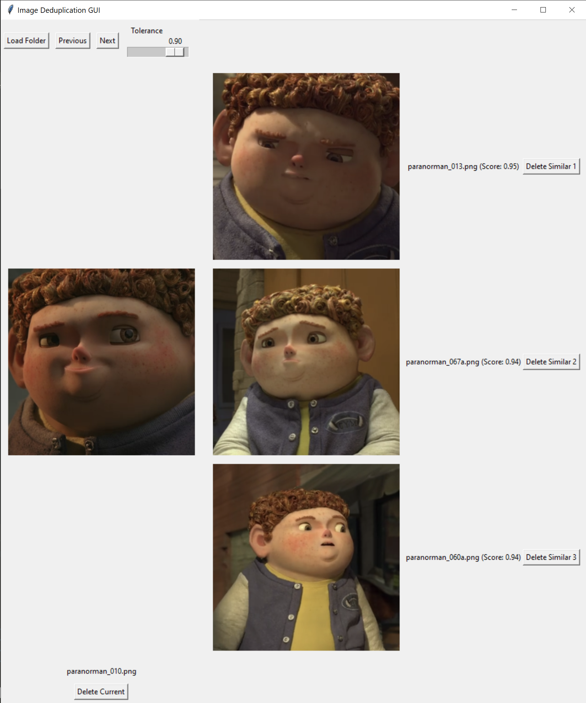
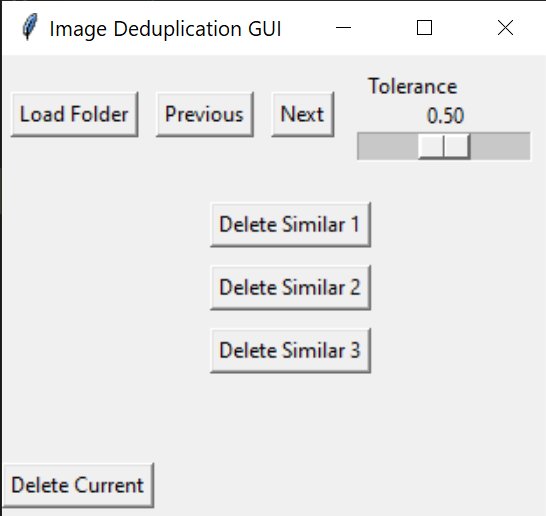

# Dedup
When creating dataset for LoRA training or checkpoint fine-tuning of image generation models such as Stable Diffusion 1.5/XL and Flux.1, one of the important steps is to filter the dataset, removing images that are low quality, but also removing images that are too similar, in order to avoid undesired bias in the final model.

Dedup is a minimalistic GUI written in Python and Tkinter to facilitate the deduplication process.

Once a folder is loaded, it displays an image and the top 3 most similar images. The options are given to delete the original image or any of the three similar images detected. Sensibility can be adjusted to only show images that are very similar, or to always show the 3 most similar images even if they are quite far from the original image.

> [!NOTE]
> Similarity is computed using CLIP, which requires downloading the ViT-B/32 model. This is done only once, the first time the app is started.

## Installation
Assuming you have [Git](https://git-scm.com/), [Python](https://www.python.org/) and [Anaconda](https://www.anaconda.com/download) installed, follow these steps to install Dedup.
1. Clone the repository to the desired location on your machine: `git clone https://github.com/brayevalerien/dedup` and move into the cloned directory using `cd dedup`.
2. Create a new Conda environment and activate it: `conda create -n dedup -y python=3.12 && conda activate dedup`.
3. Install the right torch version for your system. Go to the [Pytorch get started page](https://pytorch.org/get-started/locally/) to get the right command for your system. On mine, I use `pip install torch --index-url https://download.pytorch.org/whl/cu124`. Make sure to get a version compatible with your CUDA version to use GPU for similarity inference.
4. Install the project dependencies: `pip install -r requirements.txt`.

## Usage
Once you've followed the [installation instructions](#installation), start the app by running `python dedup_gui.py`. It will open the following window.

Click on the "Load Folder" button to load your images (that must all be in the same folder) and pre-compute the similarities. Please note that it might take a bit of time depending on the number of images in your folder and the specs of your computer. It takes around 2 minutes to load 300 FHD images on mine.

You can then view the images one by one, adjust the tolerance and delete unwanted duplicate images.

> [!CAUTION]
> All operations are permanent and bugs might happen! Make sure to backup your dataset before using Dedup.